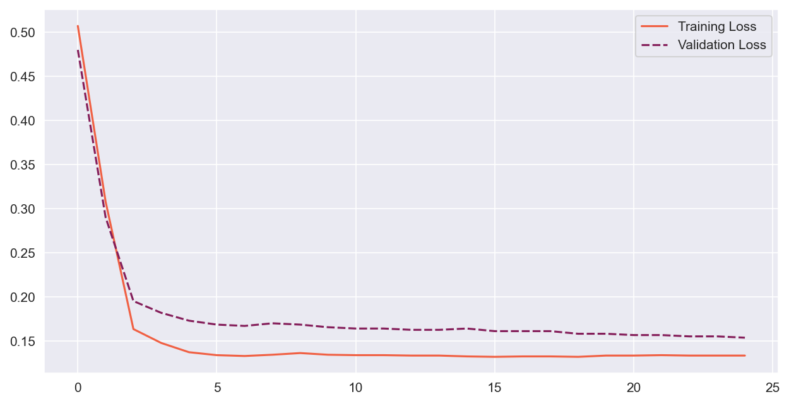
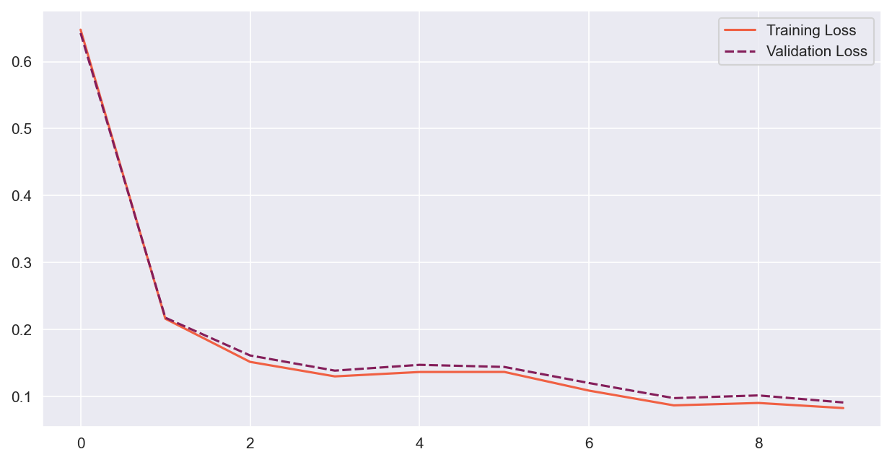
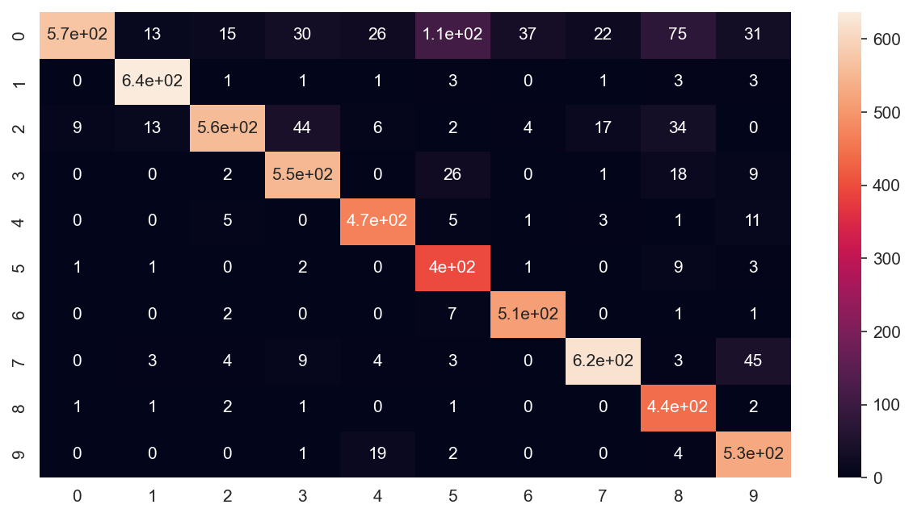

# Neural network from scratch - Another NumPy NN implementation.

## Overview
The aim of this project is to develop an Artificial Neural Network Model without using any kind of libraries (No Tensorflow, PyTorch). This work was inspired by Machine learning Master Degree course @Unipisa.

## The API
Project has been developed taking advantage of Python OOP in order to build a modern and intuitive (Tensorflow-like) API. It's possible to create and the network within 4 lines of code, as shown below:

```python
    from network import Network

    # Create the network
    model = Network(2)
    model.add_layer(16, ReLU())
    model.add_layer(8, ReLU())
    model.add_output_layer(1, Sigmoid(a=1))

    # Train your model
    stats = model.train(
        x_train, y_train, x_val, y_val, 
        estimator=SingleClassError(),
        eta=10e-2,
        epochs=25
    )

    # Make predictions
    predictions = model.output(x)
```
Shapes will be automatically detected and you're ready to go!
Model training will also return some learning statistics in order to track every step of your model training process.

The API also provides custom loss functionst to best suit different situations and scenarios.

## Under the hood
Behind the scenes there's only linear algebra and calculus: everything has been written taking advantage of the NumPy library. This is the very first implementation and many things have to be reviewed to improve speed and efficiency. 
The library has been implemented following the standard approach for densely connected neural networks. The model is divided into multiple layers, and each layer has one or more neurons. Specific implementation for `Layer` class have been introduced to model behaviour of `InputLayer` and `OutputLayer`. Model's output(s) is obtained by Forward Propagation, and model training has been implemented by exploiting Bacward Propagation and gradient descent algorithms.

More formally, everything is ruled by this set of equations:
- Layer output $o^l = f_{\sigma}(w^Tx)$, where $w^T$ is the weight matrix for the layer, and x is the vector of the imputs for that layer (can be either the x-ph pattern input fed to the network or the output of the $l-1$th layer) and $f_{\sigma}$ is an activation function (e.g. ReLU) 
- Weight decay algorithm has been implemented by gradient descent, exploiting the so called chain rule for derivatives. For each pattern $p$ fed to the model during training, output deltas $\delta^T = \nabla C \odot f'_\sigma(o^l)$  are computed and output layer's weights updated. Then, each delta is _transmitted_ to the previous layer according to each particular weight $w_{ij}$. New deltas for each hidden layer $\delta^l$ are now computed as follows: 
$$\delta^l = (w^{(l+1)}\delta^{l+1}) \odot f'_\sigma(z^l)$$

- Finally, new weights are obtained by gradient descent:
$$w^l_{new} = w_{old}^l + \eta\delta^lx$$

- Process is repeated until $\nabla C$ is sufficient small.

## Model accuracy and testing
### Accuracy on moons dataset
Code has been first tested with moons datasets ([see here](https://scikit-learn.org/stable/modules/generated/sklearn.datasets.make_moons.html)) by generating 3000 random samples belonging to two distinct classes.


Four layers model (Binary input, 2 ReLU layers with 8 units each, single unit output with Sigmoid activation) has performed very well, with around 99% accuracy on never-seen-before data.

```> Model accuracy: 100%. ROC AUC Score: 1.0```

The following picture shows training statistics across 25 training epochs.




### Accuracy on MNIST digits dataset

Similar results were acheived for the MNIST digits dataset [(here)](http://yann.lecun.com/exdb/mnist/), with an accuracy of 94.5% on Test set. Learning curve below.



And multi-label confusion matrix here.



## Conclusions
With few lines of code I was able to reach pretty good results. Further learning techniques will be implemented in the future, such as loss regularizaiton and more efficient methods for gradient descent algorithm. Code has still to be improved.

More details can be found on the repository, in particular on the attached Jupyter notebook.
